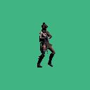

# Pixelize 3D
Transforming 3D asstets into sprite-sheets

## Demo animations checklist
- [x] Idle
- [x] Sit
- [x] Raise
- [x] Run
- [x] Jump
- [x] Die
- [x] Attack 1
- [x] Attack 2
- [x] Attack 3
- [x] Strong Attack
- [x] Dodge Back
- [x] Stop Slide
- [x] Cast forward (Punch)
- [x] Cast forward (Push)
- [x] Cast upwoard (Punch)
- [x] Punch
- [x] SholderPush
- [x] Dash
- [x] Slide
- [ ] Sit Attack
- [ ] Jump Attack 1
- [ ] Jump Attack 2

## TODOs
- [ ] find a way to blend animations
- [ ] render weapons as separate sheet
- [ ] create variable for frames/animation
- [ ] add mode to export normal maps
- [ ] add ability to do palette swapping
- [ ] make application standalone

## Dones
- [x] cycle through player animations
- [x] pixelize 3d model
- [x] reduce color space for viewport